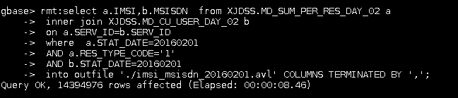

# ssh到已安装gbase客户端的主机
```bash
ssh inf4
```
# 切换到gbase用户
```bash
su gbase
passward:Gbase!234
```
# 登入gbase账户
```bash
gbase -h10.238.156.22 -ugbase -pgbase20110531
```
# 导出文件
- sql
```sql
rmt:select a.IMSI,b.MSISDN  from XJDSS.MD_SUM_PER_RES_DAY_02 a
 inner join XJDSS.MD_CU_USER_DAY_02 b
 on a.SERV_ID=b.SERV_ID
 where  a.STAT_DATE=20160201
 AND a.RES_TYPE_CODE='1'
 AND b.STAT_DATE=20160201
 into outfile './imsi_msisdn_20160201.avl' COLUMNS TERMINATED BY ',';
```
- 实例

 

*注意sql前面加`rmt:`*
- 加`rmt`会在当前执行`gbase`命令的目录输出文件
- 没有加的话会在连接gabse节点上输出文件，例如`10.238.156.22:/opt/gnode/userdate/gbase/imsi_msisdn_20160201.avl`
