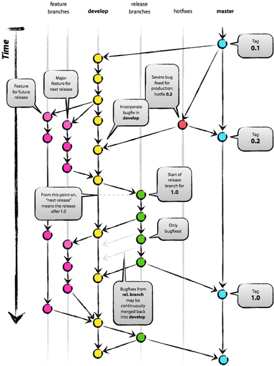
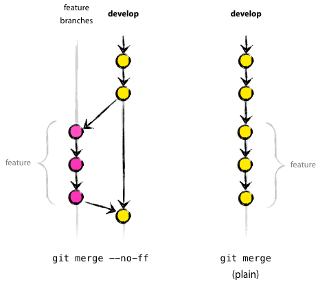

## 主要分支
中央仓库中有两个长期的分支：
- master
- develop

master用作生产分支，里面的代码是准备部署到生产环境的。
develop是可交付的开发代码，也可以看成是用于集成分支，每晚构建从develop获取代码。

当develop分支中的代码足够稳定的时候，就将改动合并到master分支，同时打上一个标签，标签的名称为发布的版本号。

## 辅助分支
通过辅助分支来帮助并行开发，和主要分支不同，这些分支的生命周期是有限的：
- 特性分支
- 发布分支
- 紧急修复分支

### 特性分支
特性分支可能从develop分支分出，最终必须合并回develop。

特性分支（也叫主题分支）用于开发新特性。每个新特性开一个新分支，最终会合并回develop（当特性开发完毕的时候），或者放弃（如果最终决定不开发这个特性）。

特性分支只存在于开发者的仓库中。

创建一个特性分支

从develop分支分出：
```bash
$ git checkout -b myfeature develop
```
合并回develop

完成的特性需要合并回develop：
```bash
$ git checkout develop
$ git merge --no-ff myfeature
$ git branch -d myfeature
$ git push origin develop
```
使用--no-ff确保总是新生成一个提交，避免丢失曾经存在一个特性分支的历史信息，也能够方便地看出哪些提交属于同一个特性。比较：



### 发布分支
发布分支可能从develop分出，最终必须合并回1develop和master。发布分支以release-*的方式命名。

发布分支为新的发布版本作准备，包括一些小bug的修正和发布的元信息（版本号、发布日期等）的添加。这样develop分支就可以接受针对以后的发布的新特性。

在代码基本可以发布的时候从develop分支分出发布分支。这时要确保此次发布包括的特性都已经合并到develop分支了（同时，为下一版发布准备的特性不能合并到develop分支，必须等待发布分支分出后才能合并）。

创建发布分支
```bash
$ git checkout -b release-1.2 develop
$ ./bump-version.sh 1.2
$ git commit -a -m "Bumped version number to 1.2"
```
bump-version.sh是一个脚本，修改相应文件的信息，以体现版本号已经改变了。

完成发布分支

当发布分支中的代码可以发布的时候，将代码合并到master分支，并打上相应的标签。同时还需要合并到develop分支，因为发布分支里可能包含一些修正bug的代码，合并回去可以确保以后的版本也包含这些修正。
```bash
$ git checkout master
$ git merge --no-ff release-1.2
$ git tag -a 1.2

$ git checkout develop
$ git merge --no-ff release-1.2
```
注意，合并回develop分支很可能导致合并冲突，我们需要手工修复一下，然后提交。之后可以删除发布分支：
```bash
$ git branch -d release-1.2
```
### 紧急修复分支
可能从master分出，必须合并回develop和master。分支名以hotfix-*开头。

紧急修复分支和发布分支很像，只不过它们是意料之外的。如果生产系统里有一个紧急的bug，必须马上修复的话，我们就从master里分出一个紧急修复分支。


这样，某个人修复紧急bug的同时，团队其他成员可以继续在develop分支上开发。

创建紧急修复分支
```bash
$ git checkout -b hotfix-1.2.1 master
$ ./bump-version.sh 1.2.1
$ git commit -a -m "Bumped version number to 1.2.1"
```
修复bug并提交
```bash
$ git commit -m "Fixed severe production problem"
```
完成紧急修复分支

修复bug之后，需要合并回master，同时也需要合并回develop。
```bash
$ git checkout master
$ git merge --no-ff hotfix-1.2.1
$ git tag -a 1.2.1

$ git checkout develop
$ git merge --no-ff hotfix-1.2.1
```
以上情况假定不存在发布分支。假设存在发布分支的话，代码不应该合并回develop，而应该合并回发布分支，确保正在准备的发布分支也能收到这个补丁（由于发布分支最终会合并到develop，因此这时不用再另外合并到develop）。

最后，删除这个紧急修复分支：
```bash
$ git branch -d hotfix-1.2.1
```
