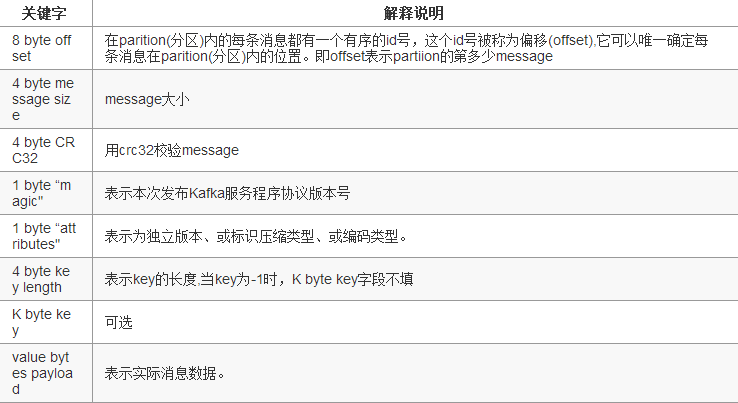

Kafka部分名词解释如下：
- Broker：消息中间件处理结点，一个Kafka节点就是一个broker，多个broker可以组成一个Kafka集群。
- Topic：一类消息，例如page view日志、click日志等都可以以topic的形式存在，Kafka集群能够同时负责多个topic的分发。
- Partition：topic物理上的分组，一个topic可以分为多个partition，每个partition是一个有序的队列。
Segment：partition物理上由多个segment组成，下面2.2和2.3有详细说明。
- offset：每个partition都由一系列有序的、不可变的消息组成，这些消息被连续的追加到partition中。partition中的每个消息都有一个连续的序列号叫做offset,用于partition唯一标识一条消息.

分析过程分为以下4个步骤：
- topic中partition存储分布
- partiton中文件存储方式
- partiton中segment文件存储结构
- 在partition中如何通过offset查找message


## topic中partition存储分布

假设实验环境中Kafka集群只有一个broker，xxx/message-folder为数据文件存储根目录，在Kafka broker中server.properties文件配置(参数log.dirs=xxx/message-folder)，例如创建2个topic名称分别为report_push、launch_info, partitions数量都为partitions=4
存储路径和目录规则为：
```
xxx/message-folder
              |--report_push-0
              |--report_push-1
              |--report_push-2
              |--report_push-3
              |--launch_info-0
              |--launch_info-1
              |--launch_info-2
              |--launch_info-3
              ```
在Kafka文件存储中，同一个topic下有多个不同partition，每个partition为一个目录，partiton命名规则为topic名称+有序序号，第一个partiton序号从0开始，序号最大值为partitions数量减1。

## partiton中文件存储方式

下面示意图形象说明了partition中文件存储方式:


- 每个partion(目录)相当于一个巨型文件被平均分配到多个大小相等segment(段)数据文件中。
- 但每个段segment file消息数量不一定相等，这种特性方便old segment file快速被删除。
- 每个partiton只需要支持顺序读写就行了，segment文件生命周期由服务端配置参数决定。
这样做的好处就是能快速删除无用文件，有效提高磁盘利用率。

## partiton中segment文件存储结构
- segment file组成：由2大部分组成，分别为index file和data file，此2个文件一一对应，成对出现，后缀".index"和“.log”分别表示为segment索引文件、数据文件.
- segment文件命名规则：partion全局的第一个segment从0开始，后续每个segment文件名为上一个segment文件最后一条消息的offset值。数值最大为64位long大小，19位数字字符长度，没有数字用0填充。

创建一个topicXXX包含1 partition，设置每个segment大小为500MB,并启动producer向Kafka broker写入大量数据,如下图2所示segment文件列表形象说明了上述2个规则：


以上图中一对segment file文件为例，说明segment中index<—->data file对应关系物理结构如下：


上图中索引文件存储大量元数据，数据文件存储大量消息，索引文件中元数据指向对应数据文件中message的物理偏移地址。
其中以索引文件中元数据3,497为例，依次在数据文件中表示第3个message(在全局partiton表示第368772个message)、以及该消息的物理偏移地址为497。
从上述图3了解到segment data file由许多message组成，下面详细说明message物理结构如下：


参数说明：



## 在partition中如何通过offset查找message

例如读取offset=368776的message，需要通过下面2个步骤查找。
- 第一步查找segment file
上述图2为例，其中00000000000000000000.index表示最开始的文件，起始偏移量(offset)为0.第二个文件00000000000000368769.index的消息量起始偏移量为368770 = 368769 + 1.同样，第三个文件00000000000000737337.index的起始偏移量为737338=737337 + 1，其他后续文件依次类推，以起始偏移量命名并排序这些文件，只要根据offset **二分查找**文件列表，就可以快速定位到具体文件。
当offset=368776时定位到00000000000000368769.index|log
- 第二步通过segment file查找message
通过第一步定位到segment file，当offset=368776时，依次定位到00000000000000368769.index的元数据物理位置和00000000000000368769.log的物理偏移地址，然后再通过00000000000000368769.log顺序查找直到offset=368776为止。
从上述图3可知这样做的优点，segment index file采取稀疏索引存储方式，它减少索引文件大小，通过mmap可以直接内存操作，稀疏索引为数据文件的每个对应message设置一个元数据指针,它比稠密索引节省了更多的存储空间，但查找起来需要消耗更多的时间。
