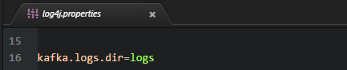
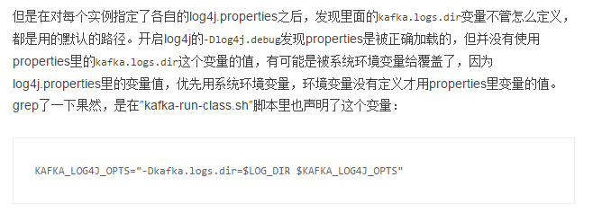
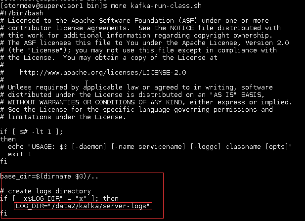

前几天维护告警说storm生产集群的某台主机硬盘快满了:worried:，赶紧排查了一下，发现是kafka log4j日志把硬盘填满了。查看了一下log4j配置文件,第16行有日志目录的配置：

于是，赶紧把配置文件里的目录改成另外一个大数据盘下的目录。目录配置成绝对路径`/data2/kafka/server-logs/`,重启kafka服务，我擦:sob:，居然日志还是没有转移，还是写在原来的目录。观察了一下原来的log4j配置，是把目录配置成相对路径，好像发现了什么，赶紧把目录配置成相对路径`../../../data2/kafka/server-logs/`,尼玛啊什么鬼:scream:，重启kafka服务，还是写在原来的目录。

:smoking::smoking::smoking:让我一个人静静:trollface:。。

:mag: *google*一下,找到了原因：

于是开始修改脚本`kafka-run-class.sh`：

