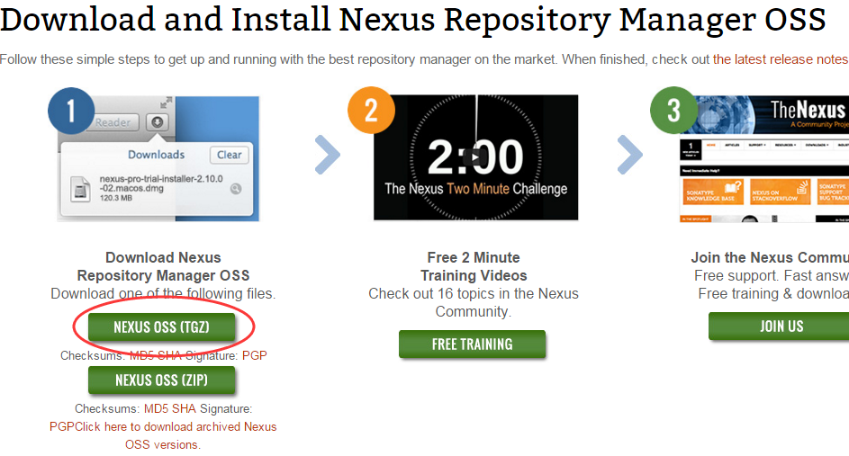
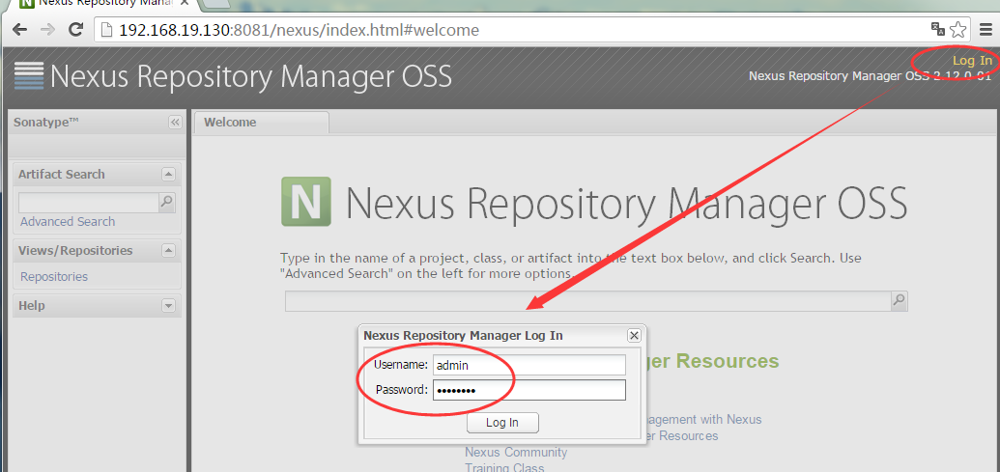
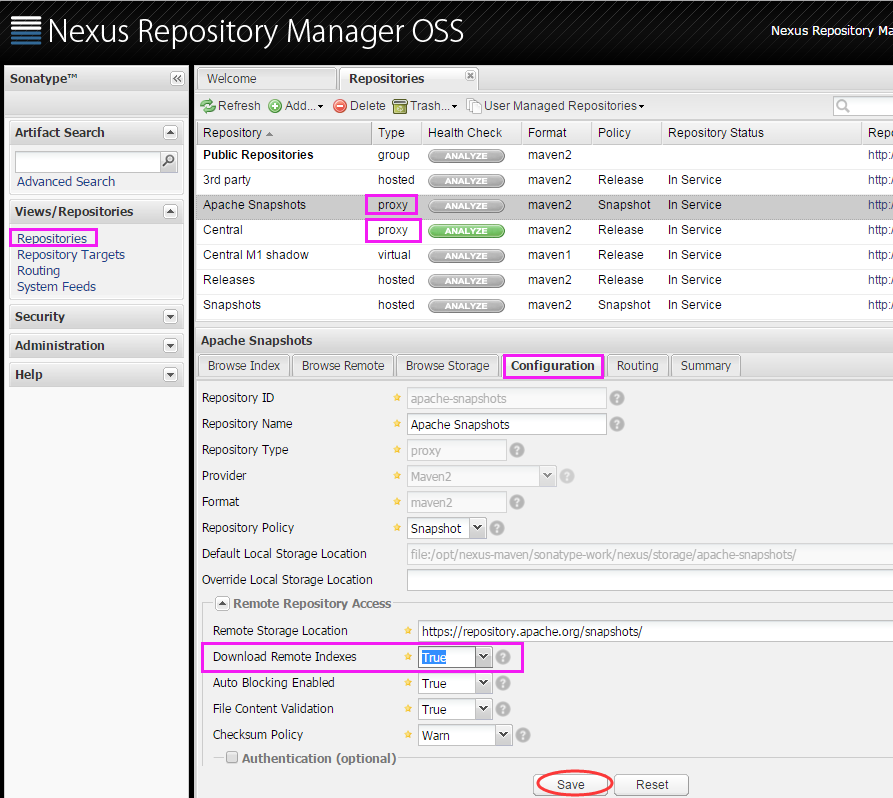
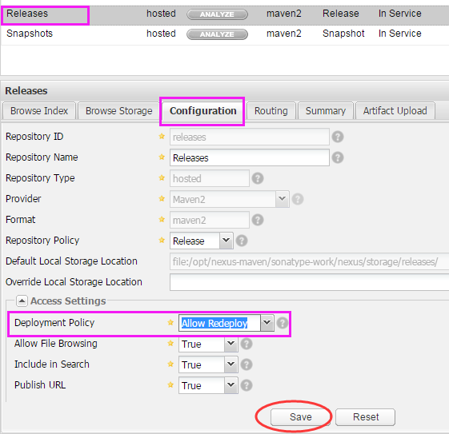
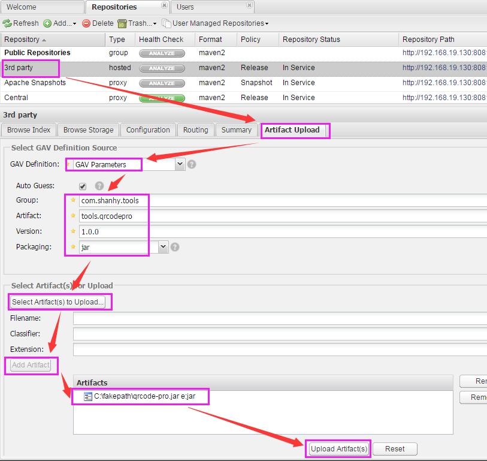
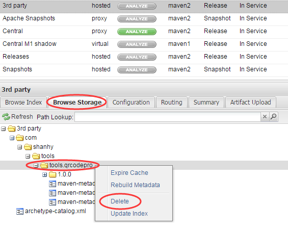
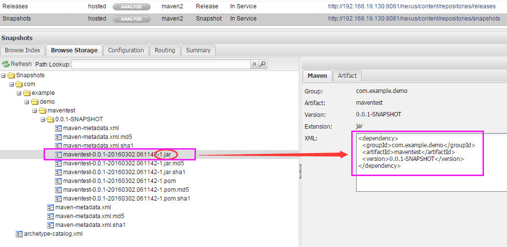

搭建私服可以做什么？
- 如果公司开发组的开发环境全部内网，这时如何连接到在互联网上的Maven中央仓库呢？
- 如果公司经常开发一些公共的组件，如何共享给各个开发组，使用拷贝方式吗？如果这样，公共库升级了怎么办？
当然可以解决的问题可能不止上面两点，下面来介绍在Linux中搭建自己的Maven私服，使用Nexus。
## 下载和安装
- 网址：http://www.sonatype.org/nexus/go/

 

- 下载包：nexus-2.12.0-01-bundle.tar.gz
- 解压包：tar -zxvf nexus-2.12.0-01-bundle.tar.gz
- 默认端口为8081，如需修改请查看配置文件 conf/nexus.properties
它本身不建议在root用户下使用，如果我们需要在root用户下启动服务，要先配置 bin/nexus 文件中的 RUN_AS_USER=root
## 私服的启动和配置
- 启动

```bash
[root@localhost nexus-maven]# cd nexus-2.12.0-01/bin/
[root@localhost bin]# ./nexus start
****************************************
WARNING - NOT RECOMMENDED TO RUN AS ROOT
****************************************
Starting Nexus OSS...
Started Nexus OSS.
[root@localhost bin]# ./nexus status
****************************************
WARNING - NOT RECOMMENDED TO RUN AS ROOT
****************************************
Nexus OSS is running (34504).
[root@localhost bin]#
```
- 启动后访问首页： http://192.168.19.130:8081/nexus/index.html
- 登录默认账号/密码 admin/admin123

 
- 打开 Repositories 将列表中所有Type为proxy 的项目的 Configuration 中的 Download Remote Indexes 设置为`True`

 
- 将Releases仓库的Deployment Policy设置为*Allow ReDeploy

 
- 设置 deployment 账户密码

 

- 然后在Central 仓库上右键然后点击 Repair Index 下载中心仓库的索引文件，若干时间后，可以点击下边的 Browse Index 即可看见下载的索引文件。
 - 当然我们也避免不了会使用到一些第三方的 jar ，而这些jar包也不存在于互联网上的maven中央仓库中，这时我们可以手工添加jar 到我们的私服中。
添加第三方 jar 如下：

 
 - 如果需要删除，如下：

 
## 本地项目配置引用私服
- 在项目的 pom.xml 中配置私库地址，pom.xml 的下面添加：
```xml
    <!-- 私有仓库 -->
    <repositories>
        <repository>
            <id>public</id>  <!--这个ID需要与你的组group ID一致-->
            <name>Public Repository</name>
            <url>http://192.168.19.130:8081/nexus/content/groups/public</url>
        </repository>
    </repositories>

    <!-- 打包发布 -->
    <distributionManagement>
        <repository>
            <id>releases</id><!--这个ID需要与你的release仓库的Repository ID一致-->
            <url>http://192.168.19.130:8081/nexus/content/repositories/releases</url>
        </repository>

        <snapshotRepository>
            <id>snapshots</id><!--这个ID需要与你的snapshots仓库的Repository ID一致-->
            <url>http://192.168.19.130:8081/nexus/content/repositories/snapshots</url>
        </snapshotRepository>
    </distributionManagement>
    ```
- 在settings.xml 中配置 server 账户信息：
```xml
  <servers>
     <server>
        <id>releases</id>
        <username>deployment</username>
        <password>dev123</password><!--这个密码就是你设置的密码-->
    </server>
    <server>
        <id>snapshots</id>
        <username>deployment</username>
        <password>dev123</password><!--这个密码就是你设置的密码-->
    </server>
  </servers>
  ```
需要说明一点：
当pom.xml中同时配置了releases仓库和snapshots仓库时。
pom.xml文件开头的版本配置1.0.0-SNAPSHOT为build到snapshots库，
pom.xml文件开头的版本配置1.0.0 (不带-SNAPSHOT) 的会build到releases库，
如果只配置了releases库而版本号写的是带-SNAPSHOT的，build到最后一步会报400错误，因为它找不到对应的库。
## 测试
- 新建一个简单的maven项目，随便写个类。
在pom.xml 文件按上面 三、本地项目配置引用私服 方法添加 私有仓库和打包发布配置
然后使用命令 mvn deploy 发布成功后，此时我们在我们的私服中就可以看到发布后的结果，如下：

 
- 再新建一个项目，或者使用已有的maven项目（最好使用别人的环境不同的电脑）。
在pom.xml 中和第1步一样先配置私库地址，然后添加第1步发布后的 dependency 后，就可以看到jar 被正常加载到工程中了。

 

 [原文](https://yq.aliyun.com/articles/7427?spm=5176.100238.yqhn2.18.NJddmy)
