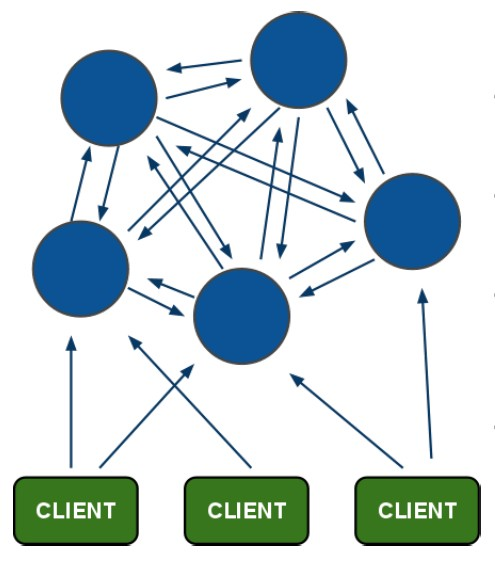

# 讲在开始
本文调研内容只涉及高可用的Redis Cluster方案，其他Redis的单实例解决方案不在讨论范围。
## Redis 简介
Redis是一个开源、基于C语言、基于内存亦可持久化的高性能NoSQL数据库，同时，它还提供了多种语言的API。
## 常见的redis使用场景
- 在主页中显示最新的项目列表。

Redis使用的是常驻内存的缓存，速度非常快。LPUSH用来插入一个内容ID，作为关键字存储在列表头部。LTRIM用来限制列表中的项目数最多为5000。如果用户需要的检索的数据量超越这个缓存容量，这时才需要把请求发送到数据库。

- 删除和过滤。

如果一篇文章被删除，可以使用LREM从缓存中彻底清除掉。

- 排行榜及相关问题。

排行榜（leader board）按照得分进行排序。ZADD命令可以直接实现这个功能，而ZREVRANGE命令可以用来按照得分来获取前100名的用户，ZRANK可以用来获取用户排名，非常直接而且操作容易。

- 按照用户投票和时间排序。

这就像Reddit的排行榜，得分会随着时间变化。LPUSH和LTRIM命令结合运用，把文章添加到一个列表中。一项后台任务用来获取列表，并重新计算列表的排序，ZADD命令用来按照新的顺序填充生成列表。列表可以实现非常快速的检索，即使是负载很重的站点。

- 过期项目处理。

使用unix时间作为关键字，用来保持列表能够按时间排序。对current_time和time_to_live进行检索，完成查找过期项目的艰巨任务。另一项后台任务使用ZRANGE...WITHSCORES进行查询，删除过期的条目。

- 计数。

进行各种数据统计的用途是非常广泛的，比如想知道什么时候封锁一个IP地址。INCRBY命令让这些变得很容易，通过原子递增保持计数；GETSET用来重置计数器；过期属性用来确认一个关键字什么时候应该删除。

- 特定时间内的特定项目。

这是特定访问者的问题，可以通过给每次页面浏览使用SADD命令来解决。SADD不会将已经存在的成员添加到一个集合。

- 实时分析正在发生的情况，用于数据统计

使用Redis原语命令，更容易实施垃圾邮件过滤系统或其他实时跟踪系统。

- Pub/Sub。

在更新中保持用户对数据的映射是系统中的一个普遍任务。Redis的pub/sub功能使用了SUBSCRIBE、UNSUBSCRIBE和PUBLISH命令，让这个变得更加容易。

- 队列。

在当前的编程中队列随处可见。除了push和pop类型的命令之外，Redis还有阻塞队列的命令，能够让一个程序在执行时被另一个程序添加到队列。你也可以做些更有趣的事情，比如一个旋转更新的RSS feed队列。

- 缓存。

Redis缓存使用的方式与memcache相同。

网络应用不能无休止地进行模型的战争，看看这些Redis的原语命令，尽管简单但功能强大，把它们加以组合，所能完成的就更无法想象。当然，你可以专门编写代码来完成所有这些操作，但Redis实现起来显然更为轻松。

## Redis Cluster
### Redis Cluster 3.0

Redis的官方集群方案是在3.0版本之后才有的特性。
四月份，Redis 3.0在经过6个RC版本后，其正式版终于发布了。Redis 3.0的最重要特征是对Redis集群的支持，此外，该版本相对于2.8版本在性能、稳定性等方面都有了重大提高。
Redis Cluster设计成无中心节点。


- 架构细节:
 - 所有的redis节点彼此互联(PING-PONG机制),内部使用二进制协议优化传输速度和带宽.
 - 节点的fail是通过集群中超过半数的节点检测失效时才生效.
 - 客户端与redis节点直连,不需要中间proxy层.客户端不需要连接集群所有节点,连接集群中任何一个可用节点即可
 - redis-cluster把所有的物理节点映射到[0-16383]slot（哈希槽实际上就是一些键的集合）上,cluster 负责维护node<->slot<->value
- Redis Cluster3.0特性说明：
TCP 端口
每一个Redis Cluster 节点需要两个打开的TCP连接。常规的 TCP宽口用于客户端通信，例如，常规端口6379，而另外一个用于集群节点间通信的端口就为16379，这个第二个端口被称之为Cluster bus。

- 数据分片
 - Redis Cluster 没有使用散列一致，不同于分区，每一个key在概念上称作是hash slot的一部分。
 - 集群一共有16384个hash slot，计算给定key位于哪个solt的方式：用CRC16算法取 key modulo 16384。
 - 集群中每个节点负责hash solt的一个子集，例如有三个节点：
 ```
Node A contains hash slots from 0 to 5500.
Node B contains hash slots from 5501 to 11000.
Node C contains hash slots from 11001 to 16384.
```
- master-slave模型
 - 为了保证集群中部分节点失败或失去连接时，集群还能使用。Redis Cluster使用一个主从模型，其中每个hash slot都有从1(master节点本身)到N个副本(N – 1个slave节点)。
 - 例如上面举例的A B C三个节点，当B节点失败，集群就无法使用，因为hash slot 从5501 到 11000都无法服务了。
 ```
而当每个节点都有一个slave节点时：A - A1   B - B1  C - C1
即使B 节点失败，集群也可以正常使用。
这时B1将成为主节点。
如果B 和 B1 都失败，集群也是不可用的。
```

- 一致性保证

 Redis cluster 无法保证很可靠的一致性。读写都只请求主节点，当一条写请求在对应的主节点写成功后，会立刻返回给客户端成功，然后主节点通过异步的方式将新的数据同步到对应的从节点，这样的方式减少了客户端多个节点写成功等待的时间，不过在某些情况下会造成写丢失。
例如当主节点B接受一条写请求，写入并返回给客户端成功后不幸宕掉，此时刚才的写还未同步给B对应的从节点B1，而从节点在发现主节点挂掉并重新选主后，新的主节点则永久丢失了之前老的主节点向用户确认的写。
   还有另一种情况，当网络发生割裂，将集群分裂成少数派与多数派，这样在客户端不知情的情况下，会将写继续写入到少数派中的某些主节点中，而当割裂超过一定时长后，集群感知到异常，此时少数派中的所有主节点会停止响应所有的写请求，多数派的其对应的从节点则会发起选举成为新的主节点，假设过了一会后割裂恢复，老的主节点发现有更新的主存在，自动变成其从节点，而新的主节点中则会永久丢失掉网络割裂至集群感知异常进行切主这个阶段老主节点确认的所有写。

Redis Cluster的更多特性可以参考官方文档：
[cluster-tutorial](http://redis.io/topics/cluster-tutorial)
[cluster-spec](http://redis.io/topics/cluster-spec)

## 国内外其他Redis集群方案
### NetFlix对Dynamo的开源通用实现Dynomite
Dynomite是NetFlix对亚马逊分布式存储引擎Dynamo的一个开源通用实现，使用C/C++语言编写、以代理的方式实现的Redis缓存集群方案。Dynomite不仅能够将基于内存的Redis和Memcached打造成分布式数据库，还支持持久化的MySQL、BerkeleyDB、LevelDB等数据库，并具有简单、高效、支持跨数据中心的数据复制等优点。Dynomite的最终目标是提供数据库存储引擎不能提供的简单、高效、跨数据中心的数据复制功能。Dynomite遵循Apache License 2.0开源协议发布，更多关于Dynomite的信息请查看NetFlix技术博客对Dynomite的介绍。
### Twitter的Redis/Memcached代理服务Twemproxy
Twemproxy是一个使用C语言编写、以代理的方式实现的、轻量级的Redis代理服务器，它通过引入一个代理层，将应用程序后端的多台Redis实例进行统一管理，使应用程序只需要在Twemproxy上进行操作，而不用关心后面具体有多少个真实的Redis或Memcached实例，从而实现了基于Redis和Memcached的集群服务。当某个节点宕掉时，Twemproxy可以自动将它从集群中剔除，而当它恢复服务时，Twemproxy也会自动连接。由于是代理，所以Twemproxy会有微小的性能损失。根据 Redis作者的测试结果，在大多数情况下，Twemproxy的性能相当不错，同直接操作Redis相比，最多只有20%的性能损失。Twemproxy遵循Apache License 2.0开源协议发布，更多关于Twemproxy的信息请登录其在Github的主页查看。
### 豌豆荚的 Redis 集群解决方案Codis
Codis是豌豆荚使用Go和C语言开发、以代理的方式实现的一个Redis分布式集群解决方案,且完全兼容Twemproxy。Twemproxy对于上一层的应用来说, 连接Codis Proxy（Redis代理服务）和连接原生的Redis服务器没有明显的区别,上一层应用能够像使用单机的 Redis一样对待。Codis底层会处理请求的转发、不停机的数据迁移等工作, 所有底层的一切处理, 对于客户端来说是透明的。总之，可以简单的认为后台连接的是一个内存无限大的Redis服务。Codis遵循MIT开源协议发布，更多关于Codis的信息请登录其在GitHub的主页查看。
8月4号，Codis2.0版正式发布。

Twitter和豌豆荚的方案是目前国内比较主流的Redis Cluster方案。
## Redis3.0集群方案分析
长期以来，Redis本身仅支持单实例，内存一般最多10~20GB。这无法支撑大型线上业务系统的需求。而且也造成资源的利用率过低——毕竟现在服务器内存动辄100~200GB。
在单实例架构上，访问Redis数据通过get(key)这样的形式。
而在集群模式下，上面提到，客户端与redis节点直连,不需要中间proxy层.客户端不需要连接集群所有节点,连接集群中任何一个可用节点即可；我们知道在无中心设计下，redis-cluster把所有的物理节点映射到[0-16383]slot上，集群中每个Redis实例负责一部分，业务程序通过集成的Redis Cluster客户端进行操作，客户端可以向任一实例发出请求，如果所需数据不在该实例中，则该实例引导客户端自动去对应实例读写数据。也就是说我们访问get(key)时可能要经过二次定位：

官方解释：
```
一个 Redis 客户端可以向集群中的任意节点（包括从节点）发送命令请求。 节点会对命令请求进行分析， 如果该命令是集群可以执行的命令， 那么节点会查找这个命令所要处理的键所在的槽。
如果要查找的哈希槽正好就由接收到命令的节点负责处理， 那么节点就直接执行这个命令。
另一方面， 如果所查找的槽不是由该节点处理的话， 节点将查看自身内部所保存的哈希槽到节点 ID 的映射记录， 并向客户端回复一个 MOVED 错误。
以下是一个 MOVED 错误的例子：
GET x
-MOVED 3999 127.0.0.1:6381

错误信息包含键x所属的哈希槽3999，以及负责处理这个槽的节点的 IP 和端口号 127.0.0.1:6381 。 客户端需要根据这个 IP 和端口号， 向所属的节点重新发送一次GET命令请求。
注意， 即使客户端在重新发送GET命令之前， 等待了非常久的时间， 以至于集群又再次更改了配置，使得节点127.0.0.1:6381已经不再处理槽3999 ， 那么当客户端向节点127.0.0.1:6381发送GET命令的时候， 节点将再次向客户端返回MOVED错误， 指示现在负责处理槽3999的节点。
虽然我们用 ID 来标识集群中的节点， 但是为了让客户端的转向操作尽可能地简单，节点在MOVED错误中直接返回目标节点的 IP 和端口号， 而不是目标节点的 ID 。
虽然不是必须的，但一个客户端应该记录（memorize）下“槽3999由节点127.0.0.1:6381负责处理“这一信息， 这样当再次有命令需要对槽3999执行时， 客户端就可以加快寻找正确节点的速度。
注意， 当集群处于稳定状态时，所有客户端最终都会保存有一个哈希槽至节点的映射记录（map of hash slots to nodes），使得集群非常高效：客户端可以直接向正确的节点发送命令请求， 无须转向、代理或者其他任何可能发生单点故障（single point failure）的实体（entiy）。
```
另外还有Ask转向，[参见](http://redis.io/topics/cluster-spec)

以上两节所述的Redis Cluster3.0特性，master-slave模型，MOVE/ASK转向等和单实例架构及其他集群架构相比，略显笨重，性能也有所下降。
数据一致性上也存在风险。
建议如果需要使用Redis Cluster，建议先在测试环境做大压力的模拟，然后用于非核心系统，如数据分析。

## 参考
[cluster-tutorial](http://redis.io/topics/cluster-tutorial)  
[cluster-spec](http://redis.io/topics/cluster-spec)
http://redis.readthedocs.org/en/latest/topic/cluster-tutorial.html  
http://redis.io/commands/cluster-failover  
http://www.infoq.com/cn/news/2014/11/open-source-redis-cache?utm_source=infoq&utm_medium=related_content_link&utm_campaign=relatedContent_articles_clk  
http://www.infoq.com/cn/articles/effective-ops-part-03#0-tsina-1-87074-397232819ff9a47a7b7e80a40613cfe1  
http://www.cnblogs.com/guoyinglin/p/4604279.html  
http://hot66hot.iteye.com/blog/2050676  
http://blog.csdn.net/myrainblues/article/details/25881535  
http://chuansong.me/n/1271889  
应用场景：http://os.51cto.com/art/201107/278292.htm  
http://database.51cto.com/art/201107/276333.htm  
