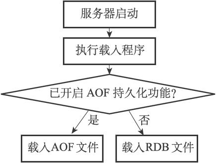

  
上图可以看出Redis在启动服务时会检查AOF功能是否开启，如果开启将载入AOF文件，否则载入RDB文件。
- AOF文件相当于内存中的数据映射到硬盘中
- RDB文件相当于Redis请求/读/写数据的日志

RDB>>AOF,从两者的文件大小就可以看出,Redis服务从AOF文件和恢复数据的速度将快于RDB文件恢复。

# RDB 持久化
RDB提供两种方式生成RDB文件，分别通过执行SAVE和BGSAVE命令生产RDB文件。SAVE由服务器进程直接执行保存，它会阻塞服务器的进程。BGSAVE是服务器子进程执行保存操作，它的运行不会阻塞服务器进程的运行。
- SVAE 命令  
SAVE命令执行时会阻塞服务器的运行。因此，在服务器执行SAVE命令时，客户端发送的所有命令请求都会被拒绝。只有服务器执行完SAVE命令，服务器才会重新接收客户端发送的命令请求。
- BGSAVE 命令  
与SAVE相反，BGSAVE由服务器子进程执行，在执行时依然可以接收客户端发送命令并处理。但是，服务器处理SAVE、BGSAVE、BGREWRITEAOF三种方式和平时有些不一样。

 - 对于SAVE，在执行BGSAVE时，客户端发送的SAVE命令会被服务器拒绝。服务器禁止SAVE和BGSAVE命令同时执行是为了防止父进程（服务器进程）和子进行同时执行产生竞争条件
 - 对于BGSAVE。在执行BGSAVE时，客户端发送的BGSAVE命令时同样也是被拒绝。原因是为了防止两个BGSAVE产生竞争条件。
 - 对于BGREWRITEAOF。在执行BGSAVE时，也是被拒绝的。原因是因为BGSAVE和BGREWRITEAOF不能同时执行。
- 定期持久化原理
```conf
save 900 1            //服务器在900秒之内，对数据库进行了至少1次修改。
save 300 10           //服务器在300秒之内，对数据库进行了至少10次修改。
save 60 10000         //服务器在60秒之内，对数据库进行了至少10000次修改。
```
redisServer会读取`redis.conf`中`save`的配置，来定期持久化。
可以参考黄健宏写的《Redis 设计与实现》里的详述。
# AOF 持久化
AOF持久化是通过保存Redis服务器所执行的写命令来记录数据库状态的。AOF持久化命令可以分为命令追加（append）、文件写入、文件同步三个步骤。
- 开启AOF持久化的配置`appendonly yes`:
命令追加
resist服务器中的结构是这样的
```
struct redisServer {
     // ...

     // AOF缓冲区
     sds aof_buf;

     // ...
}
```
服务器在执行一个写命令后，会将命令追加到 aof_buf 缓冲区的末尾。

- 命令的写入:
将命令写入到aof文件中去

- 将aof文件中的命令同步到磁盘
 - appendfsync配置说明
   - appendfsync no （同步操作交给数据库）
当设置appendfsync为no的时候，Redis不会主动调用fsync去将AOF日志内容同步到磁盘，所以这一切就完全依赖于操作系统的调试了。对大多数Linux操作系统，是每30秒进行一次fsync，将缓冲区中的数据写到磁盘上。
   - appendfsync everysec （每隔一秒执行一次同步操作）
当设置appendfsync为everysec的时候，Redis会默认每隔一秒进行一次fsync调用，将缓冲区中的数据写到磁盘。但是当这一次的fsync调用时长超过1秒时。Redis会采取延迟fsync的策略，再等一秒钟。也就是在两秒后再进行fsync，这一次的fsync就不管会执行多 长时间都会进行。这时候由于在fsync时文件描述符会被阻塞，所以当前的写操作就会阻塞。
```
结论就是，在绝大多数情况下，Redis会每隔一秒进行一 次fsync。在最坏的情况下，两秒钟会进行一次fsync操作。这一操作在大多数数据库系统中被称为group commit，就是组合多次写操作的数据，一次性将日志写到磁盘。
```
   - appendfsync always （每一次写操作都会执行同步操作）
置appendfsync为always时，每一次写操作都会调用一次fsync，这时数据是最安全的，当然，由于每次都会执行fsync，所以其性能也会受到响。

[原文](https://segmentfault.com/a/1190000004491106)
