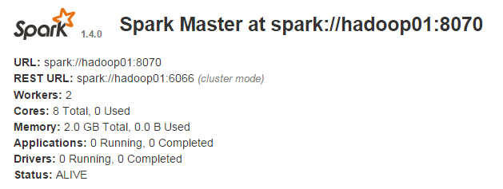

## 集群状态：
- hadoop01--master alive,zookeeper
- hadoop02--master standby,zookeeper
- hadoop03--slave,zookeeper
- hadoop04--slave

## 添加配置
- spark-env.sh
```bash
export SCALA_HOME=/usr/scala/scala-2.11.7
export JAVA_HOME=/usr/java/jdk1.7.0_55
export HADOOP_HOME=/usr/lib/hadoop
export HADOOP_CONF_DIR=/usr/lib/hadoop/etc/hadoop
export SPARK_MASTER_IP=hadoop01
export SPARK_WORKER_INSTANCES=1
export SPARK_MASTER_PORT=8070
export SPARK_MASTER_WEBUI_PORT=8090
export SPARK_WORKER_PORT=8092
export SPARK_WORKER_MEMORY=1024m
#set Spark HA
export SPARK_DAEMON_JAVA_OPTS="-Dspark.deploy.recoveryMode=ZOOKEEPER -Dspark.deploy.zookeeper.url=hadoop01:2181,hadoop02:2181,hadoop03:2181 -Dspark.deploy.zookeeper.dir=/spark"
```
- *hadoop02 master standby上“export SPARK_MASTER_IP=hadoop01”*

## 启动
- 在hadoop01：`./sbin/start-all.sh`
- 在hadoop02：`./start-master.sh`

## 查看 web ui
- hadoop01上：


- hadoop02上：


- 在hadoop01上：`./sbin/stop-master.sh` ,hadoop02上的master将自动切换成alive
