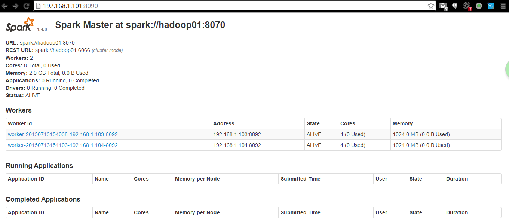

- 今天在原来hadoop集群的基础上做了一下Spark的集群安装。
 - spark版本：spark-1.4.0-bin-hadoop2.3.tgz
 - 注意最新的spark1.4适用scala 2.11编译的：scala-2.11.7.tgz

- 解压spark

- 配置
 - `spark-env.sh`
```bash
export SCALA_HOME=/usr/scala/scala-2.11.7
export JAVA_HOME=/usr/java/jdk1.7.0_55
export HADOOP_HOME=/usr/lib/hadoop
export HADOOP_CONF_DIR=/usr/lib/hadoop/etc/hadoop
export SPARK_MASTER_IP=hadoop01
export SPARK_WORKER_INSTANCES=1
export SPARK_MASTER_PORT=8070
export SPARK_MASTER_WEBUI_PORT=8090
export SPARK_WORKER_PORT=8092
export SPARK_WORKER_MEMORY=1024m
```

 - `slaves`
```bash
# A Spark Worker will be started on each of the machines listed below.
hadoop03
hadoop04
```

 - spark-defaults.conf  
```bash
# Default system properties included when running spark-submit.
# This is useful for setting default environmental settings.

# Example:
# spark.master                     spark://master:7077
spark.eventLog.enabled           true
spark.eventLog.dir               hdfs://mycluster/spark/eventLog
# spark.serializer                 org.apache.spark.serializer.KryoSerializer
# spark.driver.memory              5g
# spark.executor.extraJavaOptions  -XX:+PrintGCDetails -Dkey=value -Dnumbers="one two three"
```

- 启动
```bash
sbin/start-all.sh
```

- ui



- 测试
```bash
$ ./spark-submit --class org.apache.spark.examples.SparkPi --master spark://hadoop01:8070 /usr/lib/spark-1.4.0-bin-hadoop2.3/lib/spark-examples-1.4.0-hadoop2.3.0.jar
```
```bash
$ run-example org.apache.spark.examples.SparkPi
```
