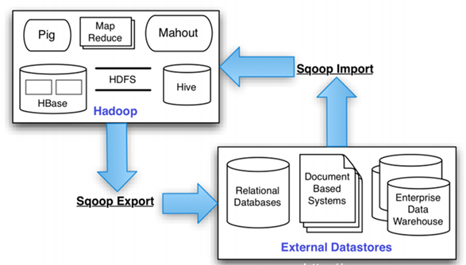
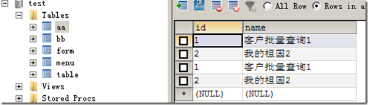

## 简介
Sqoop是一个用来将Hadoop和关系型数据库中的数据相互转移的工具，可以将一个关系型数据库（例如 ： MySQL ,Oracle ,Postgres等）中的数据导如入Hadoop的HDFS中，也可以将HDFS的数据导进到关系型数据库中。

*以下操作就是使用sqoop在mysql和hdfs之间转换数据。*

## 安装
- 解压缩
- /etc/profile中设置环境变量SQOOP_HOME
- 把mysql的驱动mysql-connector-java-5.1.10.jar复制到sqoop的lib目录下
- 重命名配置文件：`mv ${SQOOP_HOME}/conf/sqoop-env-template.sh  ${SQOOP_HOME}/confsqoop-env.sh`
- 修改配置文件sqoop-env.sh

```bash
#Set path to where bin/hadoop is available
export HADOOP_COMMON_HOME=/usr/local/hadoop/

#Set path to where hadoop-*-core.jar is available
export HADOOP_MAPRED_HOME=/usr/local/hadoop

#set the path to where bin/hbase is available
export HBASE_HOME=/usr/local/hbase

#Set the path to where bin/hive is available
export HIVE_HOME=/usr/local/hive

#Set the path for where zookeper config dir is
export ZOOCFGDIR=/usr/local/zk
```
## 使用
### 列出mysql数据库中的所有数据库
```bash
 sqoop list-databases --connect jdbc:mysql://localhost:3306/ -username dyh -password 000000
```
### 连接mysql并列出数据库中的表
```bash
sqoop list-tables --connect jdbc:mysql://localhost:3306/test --username dyh --password 000000
 ```
### 将关系型数据的表结构复制到hive中
```bash
sqoop create-hive-table --connect jdbc:mysql://localhost:3306/test --table users --username dyh
--password 000000 --hive-table users  --fields-terminated-by "\0001"  --lines-terminated-by "\n";
```
*参数说明：
--fields-terminated-by "\0001"  是设置每列之间的分隔符，"\0001"是ASCII码中的1，它也是hive的默认行内分隔符， 而sqoop的默认行内分隔符为"，"
--lines-terminated-by "\n"  设置的是每行之间的分隔符，此处为换行符，也是默认的分隔符；*

*注意：只是复制表的结构，表中的内容没有复制*
### 将数据从关系数据库导入文件到hive表中(把数据从mysql导入到hdfs中)
- 在mysql中数据库test中有一张表是aa，表中的数据如下图所示

 
- 把aa中的数据导入到hdfs中，执行命令如下
``` bash
sqoop #sqoop命令
import #表示导入
--connect jdbc:mysql://ip:3306/sqoop #告诉jdbc，连接mysql的url
--username root #连接mysql的用户名
--password admin #连接mysql的密码
--table aa #从mysql导出的表名称
--fields-terminated-by '\t' #指定输出文件中的行的字段分隔符
-m 1 ##复制过程使用1个map作业
```
- 观察hdfs的目录/user/{USER_NAME}，下面会有一个文件夹是aa，里面有个文件是part-m-00000。字段之间是使用制表符分割的。
### 将hive中的表数据导入到mysql数据库表中(把数据从hdfs导出到mysql中)
- 数据从hdfs导入到mysql中，执行命令如下
```bash
sqoop
export #表示数据从hive复制到mysql中
--connect jdbc:mysql://192.168.1.113:3306/test #告诉jdbc，连接mysql的url
--username root #连接mysql的用户名
--password admin #连接mysql的密码
--table bb ##mysql中的表，即将被导入的表名称
--export-dir '/user/root/aa/part-m-00000' ##hive中被导出的文件
--fields-terminated-by '\t' ##hive中被导出的文件字段的分隔符
```
*注意：
1、在进行导入之前，mysql中的表userst必须已经提起创建好了。
2、jdbc:mysql://192.168.20.118:3306/test中的IP地址改成localhost会报异常*
### 将数据从关系数据库导入文件到hive表中，--query 语句使用
```bash
 sqoop import --append --connect jdbc:mysql://192.168.20.118:3306/test --username dyh --password 000000 --query "select id,age,name from userinfos where \$CONDITIONS"  -m 1  --target-dir /user/hive/warehouse/userinfos2 --fields-terminated-by ",";
```
### 将数据从关系数据库导入文件到hive表中，--columns  --where 语句使用
```bash
 sqoop import --append --connect jdbc:mysql://192.168.20.118:3306/test --username dyh --password 000000 --table userinfos --columns "id,age,name"  --where "id > 3 and (age = 88 or age = 80)"  -m 1  --target-dir /user/hive/warehouse/userinfos2 --fields-terminated-by ",";
```
*注意：--target-dir /user/hive/warehouse/userinfos2   可以用  --hive-import --hive-table userinfos2 进行替换*
