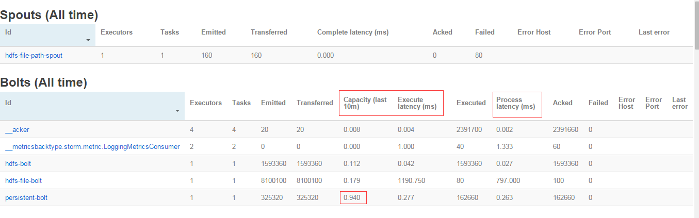
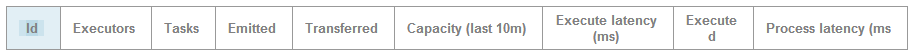
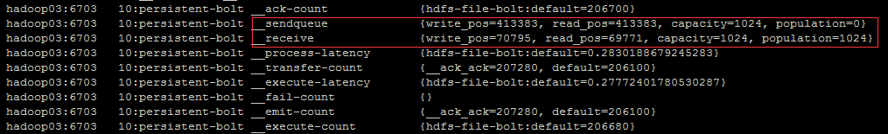

- Execute latency ：消息平均处理时间，单位毫秒
- Process latency ：消息从收到到被ack掉所花的时间，单位为毫秒。如果没有启用Acker机制，那么Process latency的值为0
- Capacity：计算公式为
 - Capacity=Bolt调用execute方法处理的消息数量 X 消息平均执行时间/时间区间
 - 如果Capacity的值接近于1，说明这个Bolt或者Executor 基本一直在调用execute方法处理，因此并行度不够，需要扩展这个组件的Executor数量。
- Strom 的metric 也提供了一些信息，可作为调优参考,关注 `__sendqueue` 发送队列消息情况 和 `__receive ` 接收队列消息情况：


 - 如果population的值比较大，接近或者等于capacity ，说明存在性能瓶颈；
 - `__sendqueue` 的population值较大，说明下游的处理速度没有跟上；
 - `__receive`  的population值较大，说明当前Executor的处理存在问题。
 - 参数：
 ```java
public static final String TOPOLOGY_EXECUTOR_RECEIVE_BUFFER_SIZE="topology.executor.receive.buffer.size";
public static final String TOPOLOGY_EXECUTOR_SEND_BUFFER_SIZE="topology.executor.send.buffer.size";
```
